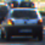
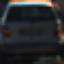
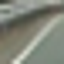
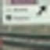
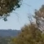
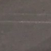
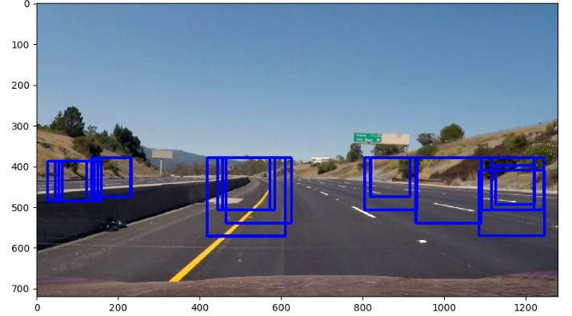
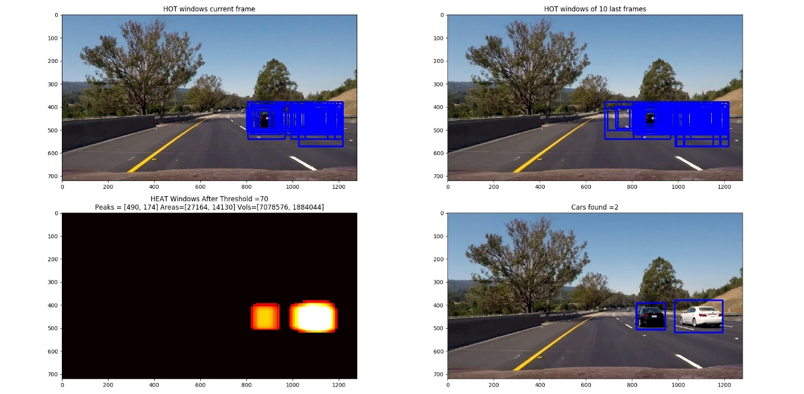

**Self-Driving Car Engineer Nanodegree**

**Project5: Vehicle Detection**

**Introduction**

The project objective was to identify cars on a video stream based on
previous classification model.

The process to accomplish it is as follows:

1.  Train a classifier

    a.  Gather data: the GTI database of labeled JPGs was used. It
        contains 2 labels: car and not car.

    b.  Choose features to extract from JPEGs: color histogram and HOG
        data.

    c.  Choose a classifier: a Support Vector Classifier was used on
        this case (Linear).

2.  Find cars on the video stream and classify

    a.  Use a sliding search window scheme to sweep thru the whole image
        (different sizes and different overlaps)

    b.  Using the trained SVC decide whether or not is a car.

    c.  Draw the bounding box of the found object and render video.

3.  Reject false positives:

    a.  At the classifier level

    b.  HEAT threshold

    c.  Averaging over several frames

**DATASET**

The dataset chosen was the GTI dataset. It contained 8800 vehicle images
and 8970 non-vehicle images. The PNGs were in size: 64x64 pixels. The
following are some random samples for vehicles and non-vehicles:

Table 1 Top row: vehicle images and Bot Row: non-vehicle images

  
  ---------------------------------------------------------------------------------------------------------------------------------------------------------------------------- ----------------------------------------------------------------------------------------------------------------------------------------------------------------------------- ---------------------------------------------------------------------------------------------------------------------------------------------------------------------------- -----------------------------------------------------------------------------------------------------------------------------------------------------------------------------
  

**FEATURES**

For the color histogram bins: spatial\_size = (16, 16) and the Spatial
binning dimensions were 16 pixels.

The features extracted from each image for HOG were: 9 orientations 8
pixels per cell and 2 cells per block.

The full size of the feature vector length: 2580

Features should were scaled to zero mean and unit variance using:

\# Fit a per-column scaler

X\_scaler = StandardScaler().fit(X)

\# Apply the scaler to X

scaled\_X = X\_scaler.transform(X)

**TRAINING**

Training using a SVC(linear) was done using all combinations of color
spaces and channels. The following is a summary of the accuracy of the
classifiers:

  **TEST ACCURACY SVC**            **TIME TO CLASSIFY and TEST \[sec\]**
  ----------------------- -------- --------------------------------------- --------- -- ------- -------- -------- ---------
  **R**                   **G**    **B**                                   **ALL**      **R**   **G**    **B**    **ALL**
  0.979                   0.983    0.979                                   0.986        11.3    11.7     12.7     38.8
                                                                                                                  
  **H**                   **S**    **V**                                   **ALL**      **H**   **S**    **V**    **ALL**
  0.969                   0.965    0.982                                   0.992        15.6    15.4     13.1     37.7
                                                                                                                  
  **L**                   **U**    **V**                                   **ALL**      **L**   **U**    **V**    **ALL**
  0.983                   0.965    0.970                                   0.994        12.1    17.3     14.1     25.3
                                                                                                                  
  **H**                   **L**    **S**                                   **ALL**      **H**   **L**    **S**    **ALL**
  0.966                   0.979    0.967                                   0.987        16.0    11.8     15.2     33.0
                                                                                                                  
  **Y**                   **U**    **V**                                   **ALL**      **Y**   **U**    **V**    **ALL**
  0.982                   0.972    0.958                                   0.993        10.6    12.3     14.8     27.4
                                                                                                                  
  **Y**                   **Cr**   **Cb**                                  **ALL**      **Y**   **Cr**   **Cb**   **ALL**
  0.984                   0.967    0.972                                   0.992        11.9    16.4     13.8     25.4

The HLS color space with all 3 channels was chosen, since it gave a high
accuracy. Also HLS was chosen because I can understand the color space,
and therefore make sense of the features found.

**Sliding Window Search**

The sliding window search was implemented using 2 functions:
slide\_window and search\_windows2. This was a simple approach to start
the project (compared to the one in which the HOG features are
calculated for the entire frame from the start). The inputs for the
process were:

-window size, overlap, and search area

-classifier, scaler

-feature parameters (spatial size, color bins, and HOG params)

The output was a list of boxes were the classifier found a car. The
search was performed mainly on the bottom half of the frame. The overlap
was set to 80-90% since it was found that a small overlap would miss the
cars too much. The high overlap ensured the cars were squared on the
search window. Also, for the smaller window sizes most of the search was
concentrated on top of the frame(y ranging \[380,520\]) and for the
large windows it cover more area (y ranging \[380,620\]). This was done
to minimize computational time (small windows could cause lots of
computations). This is shown in the image below:

{width="6.5in" height="3.5902777777777777in"}

To improve the performance of the SVC(linear) classifier, instead of
using a simple binary classification. I implemented a decision function
(prediction = int(dec\_fun &gt; 0.75). The decision function provides
the distance from the hyperplane to the sample. Since this is a binary
problem (car and not car), it is simpler to implement. Values of less
than 0.75 were rejected. This improved the accuracy of the
classification output.

**FALSE POSITIVE REJECTION**

False positives were filtered at 3 stages on the code:

1-Decision function (prediction = int(dec\_fun &gt; 0.75) instead of
simple binary classification

2-Overlapping bounding boxes (adding ‘HEAT’ using SCIPY’s function):

-function add\_heat was used to add values on overlapping pixels.

-function apply\_threshold zeroed values on heatmap below a certain
value

3-Time average over 10 frames. This rejected false positives that showed
up on image, but not consistently.

**Video Implementation**

Before the final video was created, I created a composite video that
followed the vehicle detection process to help me understand the process
better and tune parameters and improve the algorithms. The video is
named **project\_video\_output2.mp4**. A screenshot of this video is
shown below:

The 4 frames represent:

- HOT windows detected on each frame

-HOT winwdows added for the last 10 frames

-HEAT after a threshold value of 70 (7x10frames) has been applied. On
this case is showing the heat ares for 2 cars. Metrics such as peak
value, area, and “volume” were also computed and displayed to help me
make tuning decisions and improve the algorithms.

-Final video showing detected cars using the HEAT area corner values.

The final output video name is: **project\_video\_output.mp4**

**Discussion**

Problems / issues faced during the implementation of this project:

-speed issues. The sliding window implementation using ALL HOG channels
and high overlap takes a long time. This would be resolved using a
different implementation: the HOG sub-sampling window.

Where will your pipeline likely fail?

-cars that are hidden behind another car

-anything other than a car (i.e. a motorcycle or pedestrian ,etc)

What could you do to make it more robust?

-HOG sub-sampling to fine comb using higher overlap.

-Kalman filter to predict motion of vehicles, then finetune search on
those areas even more.

Discussion includes some consideration of problems/issues faced,

-When a car’s view is blocked by another car.

What could be improved about their algorithm/pipeline?

- HOG sub-sampling would speed up processing time.
